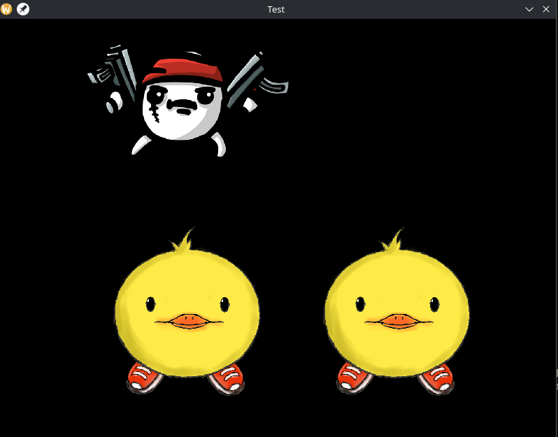

# FEUR 2D RENDERER

IL TE REGARDE QUAND TU DORT 👁️👁️



*CIELLLLLEUUUUUUUUUUH*

# NOTES

In neovim run

```bash
bear -- make clean
bear -- make
```

to create `compile_commands.json` so clang LSP work

